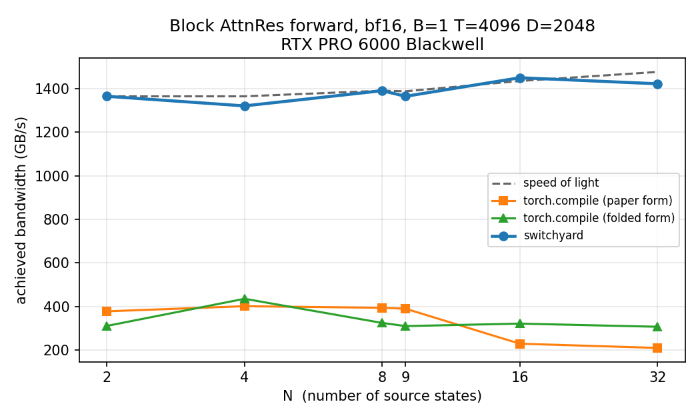

# blackwell-switchyard

A fused **Block Attention Residuals** operator for NVIDIA Blackwell, and a measured account
of how much performance the operation actually has left in it.

On an RTX PRO 6000 Blackwell (`sm_120`), at `N=9 B=1 T=4096 D=2048` in bf16 — the shape a
real Block AttnRes model spends most of its time in:

| | best framework baseline | switchyard | |
|---|---|---|---|
| forward | 0.430 ms | **0.123 ms** | **3.50×** |
| forward + backward | 1.918 ms | **0.362 ms** | **5.29×** |
| kernels (fwd / fwd+bwd) | 6 / 16 | **1 / 4** | |
| workspace above the data | 592 MiB | **464 MiB** | −22% |
| accuracy vs bf16 rounding floor | 2.3× | **1.00×** | |

The baseline is the fastest of six framework configurations — two algebraic formulations,
eager and under three `torch.compile` modes — not eager PyTorch. Median of 100
CUDA-event-timed repetitions with the 128 MiB L2 flushed between them, steady state after
compilation. Reproduce with `python bench/bench_operator.py`.

**The forward is finished.** It sustains **94–101% of speed of light** for `N` from 2 to 32,
measured against a kernel that touches exactly the same bytes with the same access pattern
but skips the softmax. There is essentially nothing left to win on the forward, and saying
so is more useful than chasing another percent.

## End to end, in a 1.3B decoder

The operator number is not the number that matters. This is
([`docs/model.md`](docs/model.md), 24 layers, d_model 2048, 8 blocks, batch 4 × seq 2048):

| variant | step ms | tokens/s | peak GiB | the residual mechanism costs |
|---|---|---|---|---|
| standard PreNorm residual (control) | 428.89 | 19101 | 30.33 | — |
| Block AttnRes, framework | 704.54 | 11627 | 31.87 | **39% of the step** |
| **Block AttnRes, switchyard** | **484.21** | **16918** | **31.86** | **11% of the step** |

Fusing takes the mechanism from **39% of a training step to 11%** — a 3.4× reduction in
its overhead, worth **1.46× end-to-end**. Adopting Block AttnRes then costs 11% of step
time and 1.5 GiB (5%) of peak memory over a standard residual, against the paper's
reported quality gains.

The end-to-end figure is smaller than the operator's 3.5–5× because the operator is one
part of a step. Quoting the Amdahl arithmetic rather than the kernel speedup is deliberate.

Separately, holding the sources in a preallocated buffer rather than `torch.stack`-ing them
at every site — as the paper's pseudocode does — saves **6.75 GiB** of peak memory (265 slab
copies per forward down to 49).

## Against the other fused kernels

Fused Block AttnRes kernels already exist. This repository claims no first — it claims a
measurement. Full tables in [`docs/third_party.md`](docs/third_party.md), all verified
against the same float64 oracle before being timed:

| | forward | fwd+bwd (wins / 10 shapes) | accuracy vs bf16 floor |
|---|---|---|---|
| **switchyard** | at the ceiling | **7** | **1.00×** |
| [fla](https://github.com/fla-org/flash-linear-attention) | at the ceiling, **beats us at D=8192** | 0 | 1.00× |
| [catswe](https://github.com/catswe/flash-attention-residuals) | at the ceiling | 0 | 1.00× |
| [Liger-Kernel](https://github.com/linkedin/Liger-Kernel) | 814–1343 GB/s | **3** (all at D≥4096 / N=32) | 1.29× |

Three honest conclusions:

- **The forward is a four-way tie at the memory ceiling.** switchyard, fla and catswe are
  all within a few percent of speed of light. There is nothing left there for anyone.
- **Liger's backward beats ours at `D ≥ 4096` and `N=32`** — exactly where our tiled
  backward runs instead of the register-resident one. That is a real deficiency, not a
  rounding error, and it is the next piece of work.
- **catswe is 4.3× faster on batched pseudo-queries** (0.215 ms vs our 0.930 ms for 8
  queries). Their two-phase schedule reads the sources once per *block*; ours reads them
  once per *call*. At S=8 that is an 8× traffic difference no kernel tuning can close —
  it is an API and scheduling difference, and the clearest single thing this comparison
  surfaced.

What this project adds, then, is the head-to-head itself — nobody had published one on any
Blackwell part — a speed-of-light ceiling so "how much is left" has a number rather than an
adjective, and a harness whose failure modes are written down, including
[the one that made fla look 11× slower than it is](docs/third_party.md#a-harness-bug-worth-recording).

## What Block AttnRes is

Attention Residuals ([Kimi Team, arXiv:2603.15031](https://arxiv.org/abs/2603.15031))
replaces the fixed residual connection `h = x + f(x)` with a softmax attention over the
outputs of preceding layers, so each layer aggregates earlier representations with learned,
input-dependent weights. **Block AttnRes** partitions depth into `N` blocks and attends over
the block summaries, taking memory from `O(Ld)` to `O(Nd)`.

Computationally it is a *depth-wise* attention: for every token position independently, a
softmax runs over the source axis. Nothing interacts across the sequence, so it looks
nothing like FlashAttention, and it has an arithmetic intensity of about **2.7 FLOP/byte**
against this machine's **204 FLOP/byte** balance point. It is memory-bound by roughly 75×.
The whole optimization problem is bytes moved, and then kernels launched.

```python
from switchyard.triton_op import block_attn_res_triton

v = torch.randn(9, 1, 4096, 2048, device="cuda", dtype=torch.bfloat16)  # [N, B, T, D]
w = torch.zeros(2048, device="cuda", dtype=torch.bfloat16)              # pseudo-query
out = block_attn_res_triton(v, w)                                       # [B, T, D]
```

## The three paths

| Path | Purpose |
|------|---------|
| [`reference.py`](src/switchyard/reference.py) | Paper-faithful PyTorch. Readable beside the paper, slow, and the correctness oracle. |
| [`baselines.py`](src/switchyard/baselines.py) | The strongest framework formulations, for `torch.compile` to work on. |
| [`triton_op.py`](src/switchyard/triton_op.py) | The fused operator. Two forward and two backward strategies, dispatched by measured tile budget. |
| [`model.py`](src/switchyard/model.py) | A 1.3B decoder that can run any of the three residual mechanisms, for the end-to-end comparison. |

## Results

Full tables across 19 shapes in [`docs/results.md`](docs/results.md) and the third-party
comparison in [`docs/third_party.md`](docs/third_party.md), both regenerated from raw JSON
in [`results/`](results/) by scripts in [`scripts/`](scripts/). A selection against the
framework baseline:

| shape (bf16) | fwd speedup | fwd+bwd speedup | % of ceiling |
|---|---|---|---|
| N=9 B=1 T=4096 D=2048 | 3.50× | 5.29× | 98% |
| N=9 B=1 T=4096 D=4096 | 3.73× | 4.40× | 95% |
| N=9 B=1 T=4096 D=8192 | 3.56× | 4.58× | 85% |
| N=32 B=1 T=4096 D=2048 | 4.62× | 7.83× | 96% |
| N=9 B=8 T=2048 D=2048 | 4.25× | 6.42× | 99% |

Where it does **not** win: at `T ≤ 512` the operator is launch-bound rather than
bandwidth-bound, and both the kernel and the ceiling are a single ~8 µs launch, so the
margin narrows to 2.2–3.0×. At `D=8192` the tiled path reaches 85% of ceiling rather than
~98%.



## Correctness

The pass criterion is relative L2 against a float64 oracle, reported alongside the error
that merely *rounding* the exact answer to the working dtype would cost — so the bar is "as
good as the format allows" rather than a tolerance tuned until things pass.

The fused kernel is **more accurate than the framework baseline**: 1.00× the bf16 rounding
floor across all sixteen tested shapes, against 1.6–3.3× for the eager chain. It accumulates
in fp32 and rounds once; the eager chain rounds at every step. Fusion usually trades accuracy
for speed, and here it does the opposite.

113 tests cover both dispatch strategies, three dtypes, non-power-of-two `N`/`D`/`T`,
`gradcheck` and `gradgradcheck` in float64, online-softmax merge exactness, saturated-logit
overflow, non-contiguous inputs, and — for the model — that the source-count schedule matches
the paper's Eq. 6, that the two AttnRes modes are parameter-matched, and that all three
residual modes still learn.

## Hardware and environment

NVIDIA RTX PRO 6000 Blackwell Max-Q, CC 12.0 (`sm_120`), 188 SMs, 128 MiB L2, 95 GiB,
300 W. Two cards, PCIe-only (no NVLink). Measured: 1462 GB/s DRAM copy, 6064 GB/s L2 peak
(4.15× DRAM), 299 TFLOP/s bf16, 9.3 µs Triton launch overhead. Full capture in
[`docs/machine.md`](docs/machine.md); nothing in this repository divides by a spec-sheet
number.

Nsight Compute is unusable on this host (`ERR_NVGPUCTRPERM`, and lifting it is a host-wide
driver change this project will not make on a shared machine), so profiling uses `nsys`,
`torch.profiler`, and achieved bandwidth from measured latency against exact byte counts.

## Reproducing

```bash
scripts/fetch_python_headers.sh   # host lacks python3.12-dev; unpacks locally, installs nothing
source scripts/env.sh
python -m pytest tests/ -q        # 113 tests
python bench/machine.py           # machine characterization -> results/machine.json
python bench/bench_operator.py    # operator sweep       -> results/operator_*.json
python scripts/summarize_operator.py   # -> docs/results.md and its figure

scripts/fetch_third_party.sh      # clone Liger / fla / catswe at pinned commits
python bench/bench_third_party.py # head-to-head  -> results/third_party_bfloat16.json
python scripts/summarize_third_party.py   # -> docs/third_party.md

python bench/bench_model.py       # 1.3B end-to-end -> results/model_bfloat16.json
python scripts/summarize_model.py # -> docs/model.md
```

## Engineering report

[`docs/report.md`](docs/report.md) carries the full account: the performance model, the
baseline profile, the design, and — at some length — the measurement bugs found and fixed
along the way. Two of them would have produced flattering numbers, including a bandwidth
probe that reported L2 as slower than DRAM and a backward fallback that was quietly *slower*
than the baseline it was meant to beat.

## Project state

[`PROJECT_STATE.md`](PROJECT_STATE.md) and [issue #1](https://github.com/sabdulmajid/blackwell-switchyard/issues/1)
track what is done, in progress, and next, with a decision log recording every change of
direction and the evidence that forced it.

## Attribution

Attention Residuals is the work of the **Kimi Team at Moonshot AI**
([paper](https://arxiv.org/abs/2603.15031), [repository](https://github.com/MoonshotAI/Attention-Residuals)).
The upstream repository is documentation-only and carries no LICENSE, so everything here is
implemented from the published mathematics rather than adapted from upstream code. This
project is independent and not affiliated with Moonshot AI.

```bibtex
@misc{chen2026attnres,
  title         = {Attention Residuals},
  author        = {Kimi Team},
  year          = {2026},
  archiveprefix = {arXiv},
  eprint        = {2603.15031},
  primaryclass  = {cs.CL}
}
```

## License

Apache-2.0. See [`LICENSE`](LICENSE).
